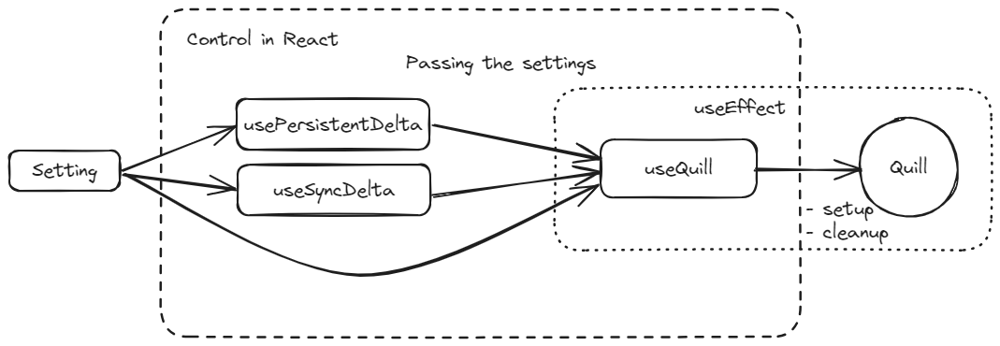

# React Hook Quill
React Hook Quill is a lightweight wrapper for [Quill](https://quilljs.com/) that does not interfere with the design of either React or Quill.

Quill is implemented without frameworks like React. To put it simply, this hook internally initializes Quill as an [external system](https://react.dev/reference/react/useEffect#connecting-to-an-external-system) within React using `useEffect` and cleans it up during a re-render and the unmount phase.



## Quick Start
### Install
```bash
npm install react-hook-quill
```

### Non-state Control of `Delta` with React using `useQuill` and `usePersistentDelta`
In this case, user edits are outside of the React lifecycle. React doesn't track the Quill changes, but user edits are automatically retained.

```tsx
import { memo, useRef } from 'react';
import 'quill/dist/quill.snow.css';
import { Delta } from 'quill';
import { useQuill, usePersistentDelta } from 'react-hook-quill';

// Use `memo` to avoid re-rendering when the parent component re-renders.
// This is for performance purposes only.
const Editor = memo(() => {
  const ref = useRef<HTMLDivElement>(null);
  const { persistentDeltaSetting } = usePersistentDelta(
    {
      containerRef: ref,
      options: {
        theme: 'snow'
      },
      setup: (quill) => {
        // Disable undo for the initial text. (optional)
        quill.history.clear()
      }
    },
    // Set an initial Delta (optional).
    new Delta().insert('Hello Quill')
  );

  useQuill({ setting: persistentDeltaSetting });

  return (
    <div ref={ref} />
  );
});
```

#### Reference
- memo: https://react.dev/reference/react/memo

### State Control of `Delta` with React using `useQuill` and `useSyncDelta`
`useSyncDelta` automatically sets up the state of `Delta` with React.

Note that you may not really need to sync `Delta` with React in your application.
Syncing `Delta` triggers a re-render with every user's edit and it may become an overhead in some cases.

```tsx
import { useRef } from 'react';
import { Delta } from 'quill';
import 'quill/dist/quill.snow.css';
import { useQuill, useSyncDelta } from 'react-hook-quill';

const Editor = () => {
  const ref = useRef<HTMLDivElement>(null);
  const { delta, syncDeltaSetting } = useSyncDelta(
    {
      containerRef: ref,
      options: {
        theme: 'snow'
      },
      setup: (quill) => {
        // Disable undo for the initial text. (optional)
        quill.history.clear()
      }
    },
    // Set an initial Delta (optional).
    new Delta().insert('Hello Quill')
  );

  useQuill({
    setting: syncDeltaSetting
  });

  return (
    <>
      <div ref={ref} />
      <div>{JSON.stringify(delta)}</div>
    </>
  );
};
```
#### Reference
- Render and Commit: https://react.dev/learn/render-and-commit

## Access to the Quill instance
`Delta` is accessible via the return value of `useQuill` as a reference to the Quill instance.

```ts
...

const quillRef = useQuill({
  setting: {
    containerRef: ref
  }
});

...

// This code must be inside useEffect or event handlers to avoid reading while rendering.
// See the pitfall of useRef: https://react.dev/reference/react/useRef#referencing-a-value-with-a-ref
const delta = quillRef.current?.editor.delta;

...
```
Quill API is fully accessible in the same way as mentioned above.

#### Reference
- Delta: https://quilljs.com/docs/delta
- Quill API: https://quilljs.com/docs/api
- Pitfall of useRef: https://react.dev/reference/react/useRef#referencing-a-value-with-a-ref

## Types and Interfaces
### Setting
A type for the parameter of `useQuill`.
```ts
export type Setting<ModuleOption = unknown> = {

  /**
   * A div element to attach a Quill Editor to
   */
  containerRef: React.RefObject<HTMLDivElement | null>;

  /**
   * Options for initializing a Quill instance
   * See: https://quilljs.com/docs/configuration#options
   */
  options?: SafeQuillOptions<ModuleOption>;

  /**
   * This function is executed only once when Quill is mounted.
   * A common use case is setting up synchronization of the Delta stored on the React side when the Quill side changes.
   * You can read or write a ref object inside.
   */
  setup?: (quill: Quill) => void;

  /**
   * This function is executed only once when Quill is unmounted.
   * You can read or write a ref object inside.
   */
  cleanup?: (quill: Quill) => void;
}
```
### SafeQuillOptions
It extends the type of `modules` in `QuillOptions` to explicitly specify its type using generics. It is originally `Record<string, unknown>`.
```ts
interface SafeQuillOptions<ModuleOption> extends QuillOptions {
  modules?: Record<string, ModuleOption>;
}
```

#### Reference
- QuillOptions: https://quilljs.com/docs/configuration#options
- Modules: https://quilljs.com/docs/modules

## Hooks
### `useQuill`
It initializes Quill in a React component **after the DOM has been mounted**.

#### Parameters
| |arg         |type                  |         |                                         |
|-|------------|----------------------|---------|-----------------------------------------|
|1|{ setting } |{ setting: `Setting` }|required | See the section of [setting](#setting). |

#### Returns
A reference to the Quill instance. Before it is instantiated, the ref points to `null`.

type: `React.MutableRefObject<Quill | null>`


----

### `usePersistentDelta`

#### Parameters
| |arg         |type     |         |                                        |
|-|------------|---------|---------|----------------------------------------|
|1|setting     |`Setting`|required | See the section of [setting](#setting).|
|2|initialDelta|`Delta`  |optional | The default value is `new Delta()`     |

#### Returns
type:
```ts
{
    persistentDeltaSetting: Setting<unknown>;
    updateSetting: (setting: Setting) => void;
}
```
|key                   |                                                                                                 |
|----------------------|-------------------------------------------------------------------------------------------------|
|persistentDeltaSetting| This is used for passing to `useQuill`.                                                         |
|updateSetting         | Update `Setting`. It invokes a cleanup function of `useQuill` and creates a new Quill instance. |

----

### `useSyncDelta`

#### Parameters
| |arg         |type     |         |                                        |
|-|------------|---------|---------|----------------------------------------|
|1|setting     |`Setting`|required | See the section of [setting](#setting).|
|2|initialDelta|`Delta`  |optional | The default value is `new Delta()`     |

#### Returns
type:
```ts
{
    delta: Delta;
    setDelta: React.Dispatch<React.SetStateAction<Delta>>;
    syncDelta: (quill: Quill | null, delta: Delta) => void;
    syncDeltaSetting: Setting<unknown>;
    updateSetting: (setting: Setting) => void;
}
```
|key             |                                                                                                                                  |
|----------------|----------------------------------------------------------------------------------------------------------------------------------|
|delta           | A state of `Delta` on the React side. User edits are automatically synced.                                                       |
|setDelta        | **Minor use cases**. Note that it changes the state of `Delta` only on the React side. Use `syncDelta` if you update both sides. |
|syncDelta       | Change the `Delta` both on the React and Quill sides at once.                                                                    |
|syncDeltaSetting| This is used for passing to `useQuill`.                                                                                          |
|updateSetting   | Update `Setting`. It invokes a cleanup function of `useQuill` and creates a new Quill instance.                                  |


## More Examples
### Non-state Control of `Delta` with React
```tsx
import { memo, useRef } from 'react';
import { Delta } from 'quill';
import 'quill/dist/quill.snow.css';
import { useQuill } from 'react-hook-quill';

const Editor = memo(() => {
  const ref = useRef<HTMLDivElement>(null);
  // A reference to the delta that keeps user edits when the parent component re-renders.
  const deltaRef = useRef<Delta | null>(null);

  useQuill({
    setting: {
      containerRef: ref,
      options: {
        theme: 'snow'
      },
      setup: (quill) => {
        // If previous user edits exist, set up the delta.
        // You can read or write to the ref object because this function is called internally in `useEffect`.
        // See the pitfall of useRef: https://react.dev/reference/react/useRef#referencing-a-value-with-a-ref
        if (deltaRef.current) {
          quill.setContents(deltaRef.current);
        }
      },
      cleanup: (quill) => {
        // Save user edits when it cleans up.
        // It's the same as `setup`, you can read or write a ref object.
        deltaRef.current = quill.editor.delta;
      }
    }
  });

  return (
    <div ref={ref} />
  );
});
```
#### Reference
- memo: https://react.dev/reference/react/memo
- Pitfall of useRef: https://react.dev/reference/react/useRef#referencing-a-value-with-a-ref


### Configure options
```tsx
import { memo, useRef } from 'react';
import 'quill/dist/quill.snow.css';
import { useQuill, usePersistentDelta } from 'react-hook-quill';

// https://quilljs.com/docs/modules/toolbar
const toolbarOptions = [
  ['bold', 'italic', 'underline', 'strike'],
  ['blockquote', 'code-block'],
  ['link', 'image', 'video', 'formula'],

  [{ header: 1 }, { header: 2 }],
  [{ list: 'ordered' }, { list: 'bullet' }, { list: 'check' }],
  [{ script: 'sub' }, { script: 'super' }],
  [{ indent: '-1' }, { indent: '+1' }],
  [{ direction: 'rtl' }],

  [{ size: ['small', false, 'large', 'huge'] }],
  [{ header: [1, 2, 3, 4, 5, 6, false] }],

  [{ color: [] }, { background: [] }],
  [{ font: [] }],
  [{ align: [] }],

  ['clean']
];

const Editor = memo(() => {
  const ref = useRef<HTMLDivElement>(null);
  const { persistentDeltaSetting } = usePersistentDelta({
    containerRef: ref,
    options: {
      theme: 'snow',
      placeholder: 'Enter some text...',
      modules: {
        toolbar: toolbarOptions
      }
    }
  });

  useQuill({ setting: persistentDeltaSetting });

  return (
    <div ref={ref} />
  );
});
```
### Configure modules
```tsx
import { memo, useRef } from 'react';
import 'quill/dist/quill.snow.css';
import Quill, { Module } from 'quill';
import { useQuill, usePersistentDelta, Setting } from 'react-hook-quill';

interface CounterModuleOptions {
  container: '#counter';
  unit: 'word' | 'character';
}

// https://quilljs.com/docs/guides/building-a-custom-module
class Counter extends Module<CounterModuleOptions> {
  public quill: Quill;

  public options: CounterModuleOptions;

  constructor (quill: Quill, options: CounterModuleOptions) {
    super(quill, options);
    this.quill = quill;
    this.options = options;
    quill.on(Quill.events.TEXT_CHANGE, this.update.bind(this));
  }

  calculate () {
    const text = this.quill.getText();

    if (this.options.unit === 'word') {
      const trimmed = text.trim();
      return trimmed.split(/\s+/).length;
    } else {
      return text.length;
    }
  }

  update () {
    const length = this.calculate();
    let label = this.options.unit;
    if (length !== 1) {
      label += 's';
    }

    const container = document.querySelector(this.options.container);
    if (container) {
      container.textContent = `${length} ${label}`;
    }
  }
}

Quill.register('modules/counter', Counter);

const Editor = memo(() => {
  const ref = useRef<HTMLDivElement>(null);
  const setting: Setting<CounterModuleOptions> = {
    containerRef: ref,
    options: {
      theme: 'snow',
      modules: {
        counter: {
          container: '#counter',
          unit: 'character'
        }
      }
    }
  };

  const { persistentDeltaSetting } = usePersistentDelta(setting);
  useQuill({ setting: persistentDeltaSetting });

  return (
    <>
      <div ref={ref} />
      <div id='counter' />
    </>
  );
});
```
### Configure blots
```tsx
import { memo, useRef } from 'react';
import { useQuill, usePersistentDelta } from 'react-hook-quill';
import Quill from 'quill';
import { BlockEmbed } from 'quill/blots/block';
import 'quill/dist/quill.snow.css';

type DividerValue = 'blue' | 'red';

class DividerBlot extends BlockEmbed {
  static blotName = 'divider';

  static tagName = 'hr';

  static create (value: DividerValue) {
    const node = super.create(value);
    if (node instanceof HTMLElement) {
      node.setAttribute('style', `border: 1px solid ${value};`);
    }
    return node;
  }
}

Quill.register(DividerBlot);

const Editor = memo(() => {
  const ref = useRef<HTMLDivElement>(null);
  const { persistentDeltaSetting } = usePersistentDelta(
    {
      containerRef: ref,
      options: {
        theme: 'snow'
      }
    }
  );

  const quillRef = useQuill({ setting: persistentDeltaSetting });

  return (
    <>
      <div ref={ref} />
      <button onClick={() => {
        const quill = quillRef.current;
        if (quill) {
          const range = quill.getSelection(true);
          const dividerValue: DividerValue = 'blue';
          quill.insertText(range.index, '\n', Quill.sources.USER);
          quill.insertEmbed(range.index + 1, 'divider', dividerValue, Quill.sources.USER);
          quill.setSelection(range.index + 2, Quill.sources.SILENT);
        }
      }}>
        Add Divider
      </button>
    </>
  );
});
```
### Update settings
```tsx
import { memo, useRef, useState } from 'react';
import 'quill/dist/quill.snow.css';
import 'quill/dist/quill.bubble.css';
import { useQuill, usePersistentDelta } from 'react-hook-quill';

export const Editor = memo(() => {
  const ref = useRef<HTMLDivElement>(null);
  const [theme, setTheme] = useState('snow');
  const { persistentDeltaSetting, updateSetting } = usePersistentDelta({
    containerRef: ref,
    options: {
      theme: 'snow'
    }
  });

  useQuill({ setting: persistentDeltaSetting });

  return (
    <>
      <div ref={ref} />
      <button onClick={() => {
        const nextTheme = theme === 'snow' ? 'bubble' : 'snow';
        updateSetting({
          containerRef: ref,
          options: {
            theme: nextTheme
          }
        });
        setTheme(nextTheme);
      }}>
        Change the theme
      </button>
    </>
  );
});
```